# CodingWeek 2025
**TELECOM Nancy - 06/01 au 10/01**

Les instructions sur l'organisation et les attendus de la semaine se trouvent dans le fichier [INSTRUCTIONS.md](./INSTRUCTIONS.md).

TABLE DES MATIÈRES
=================

   * [Le groupe](#le-groupe)
   * [Exécution](#exécution)
   * [La vidéo de présentation de notre projet](@la-vidéo-de-présentation-de-notre-projet)
   * [Le jeu](#le-jeu)
     * [La page ACCUEIL](#la-page-accueil)
     * [La page ADD CARD](#la-page-add-card)
     * [La page CONFIGURATION](#la-page-configuration)
     * [La page GUESSER](#la-page-guesser)
     * [La page SPY](#la-page-spy)
     * [La page GAME OVER](#la-page-game-over)
     * [La page STATISTIQUES](#la-page-statistiques)
   * [Les tests](#les-tests)
   * [La planification](#la-planification)
   * [Le diagramme de classes](#le-diagramme-de-classes)


# Le groupe 
Le groupe 25 est composé des étudiants suivants : 
- BICHE Martin 
- PUGO Divya
- QUILLIOT Ethan 
- VIGNAU SICARD Gauthier

# La vidéo de présentation de notre projet

CLiquez sur ce lien pour accéder à la vidéo de présentation de notre projet : [Vidéo de présentation](https://youtu.be/UjX4wLd-gos)

# Exécution

Faire cette commande à la racine de ce projet :

```bash
java --module-path /path/to/javafx/lib --add-modules javafx.controls,javafx.fxml -jar grp25.jar
```

#### ⚠️ **Attention** ⚠️ :
Il faut un fichier mots.json dans le même dossier que le jar pour que celui-ci puisse récupérer les catégories, mots et images pour jouer.


# Le jeu
# La page ACCUEIL


Cette page se lance lorsque vous lancez le jeu. Vous avez le choix entre 4 boutons :
- *Rules* : il vous redirige vers la page internet des règles du jeu 
- *Add Card* : il vous redirige vers la page d'ajout de cartes de jeu
- *Play* : il vous redirige vers la page de configuration de votre partie
- *Quit* : il vous permet de quitter le jeu

# La page ADD CARD

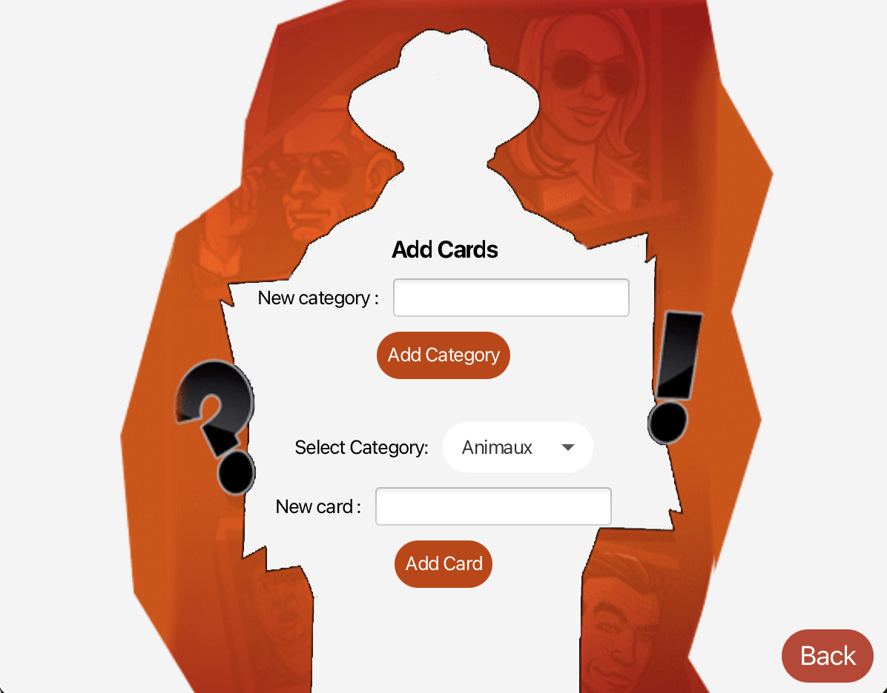

Cette page permet à l'utilisateur d'ajouter des cartes ou une catégorie au jeu. 
Pour ajouter une catégorie, il doit renseigner le nom de la catégorie puis cliquer sur le bouton *Add Category*.
Pour ajouter une carte, il doit renseigner la catégorie associée à la carte, le mot à faire deviner et enfin appuyer sur le bouton *Add Card*.

# La page CONFIGURATION

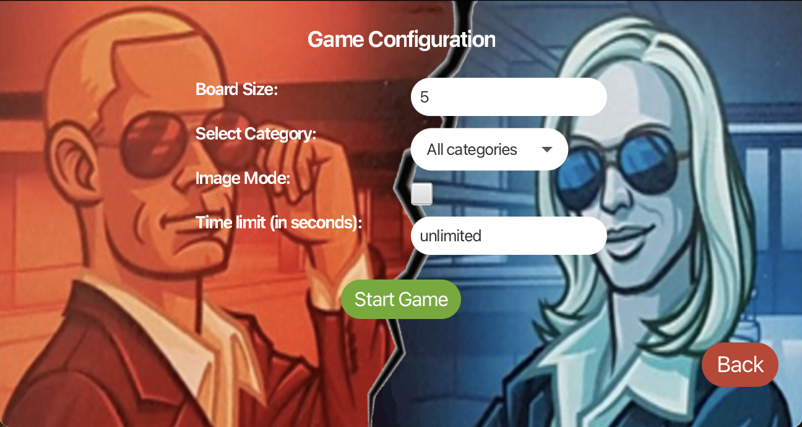 

Cette page permet à l'utilisateur de configurer sa partie. 
Il doit renseigner la taille de la grille (un entier compris entre 3 et 6 inclus) et la catégorie avec laquelle il souhaite jouer. 
Il peut aussi le mode de jeu **Image** en cliquant sur la case à cocher. 
L'utilisateur peut aussi choisir de jouer avec un chronomètre indiquant le temps restant au **GUESSER** pour jouer. 
Une fois les paramètres renseignés, il peut cliquer sur le bouton *Start Game* pour lancer la partie. 
Si besoin, il peut cliquer sur le bouton *Return Menu* pour revenir à la page d'accueil. 
Par défaut, les paramètres sont initialisés à 5 pour la taille de la grille, la catégorie **All categories**, le mode **Word** et le chronomètre désactivé.

# La page GUESSER

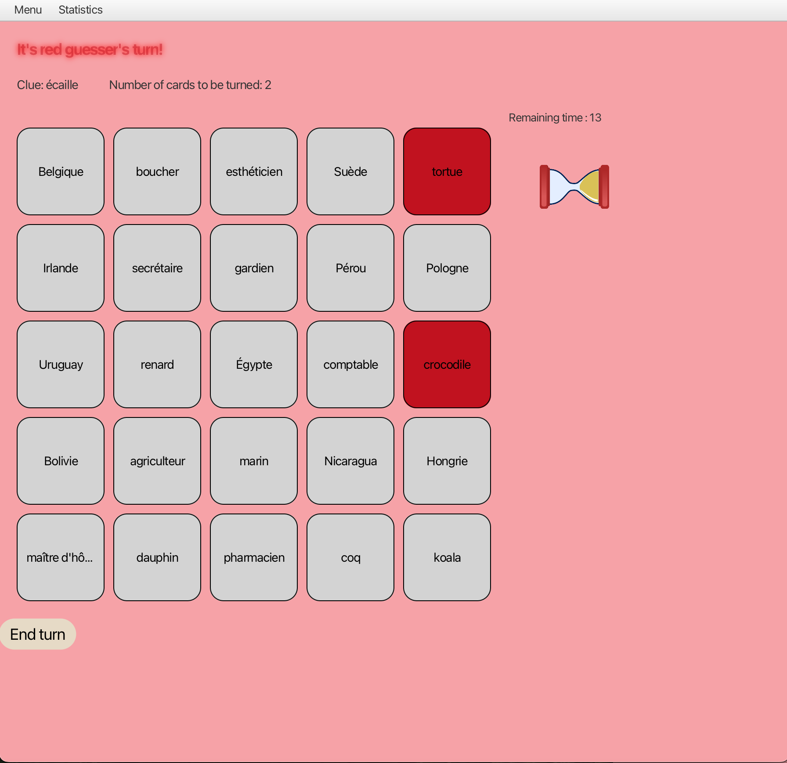

Cette page est la page de jeu du **GUESSER** en mode **Word**. 
Ici, on constate que c'est au tour du **GUESSER rouge** de jouer. 
Plusieurs actions sont possibles : 
- Cliquer sur le bouton *Menu* qui affiche un menu déroulant permettant, au choix, de charger une ancienne partie non terminée, sauvegarder la partie actuelle ou retourner à la page d'accueil. 
- Cliquer sur le bouton *Statistics* qui affiche les statistiques de jeu des équipes. 
- Cliquer sur une case de la grille pour découvrir la couleur associée. Le choix doit correspondre à l'indice donné par le **SPY**, qui est affiché en haut de la page. 
- Cliquer sur le bouton *End tour* pour passer son tour. 

Le temps restant pour jouer est affiché en haut à droite de la page, avec un sablier qui se vide et tourne sur lui-même. 
La couleur du fond de la page est celle de l'équipe qui doit jouer. 

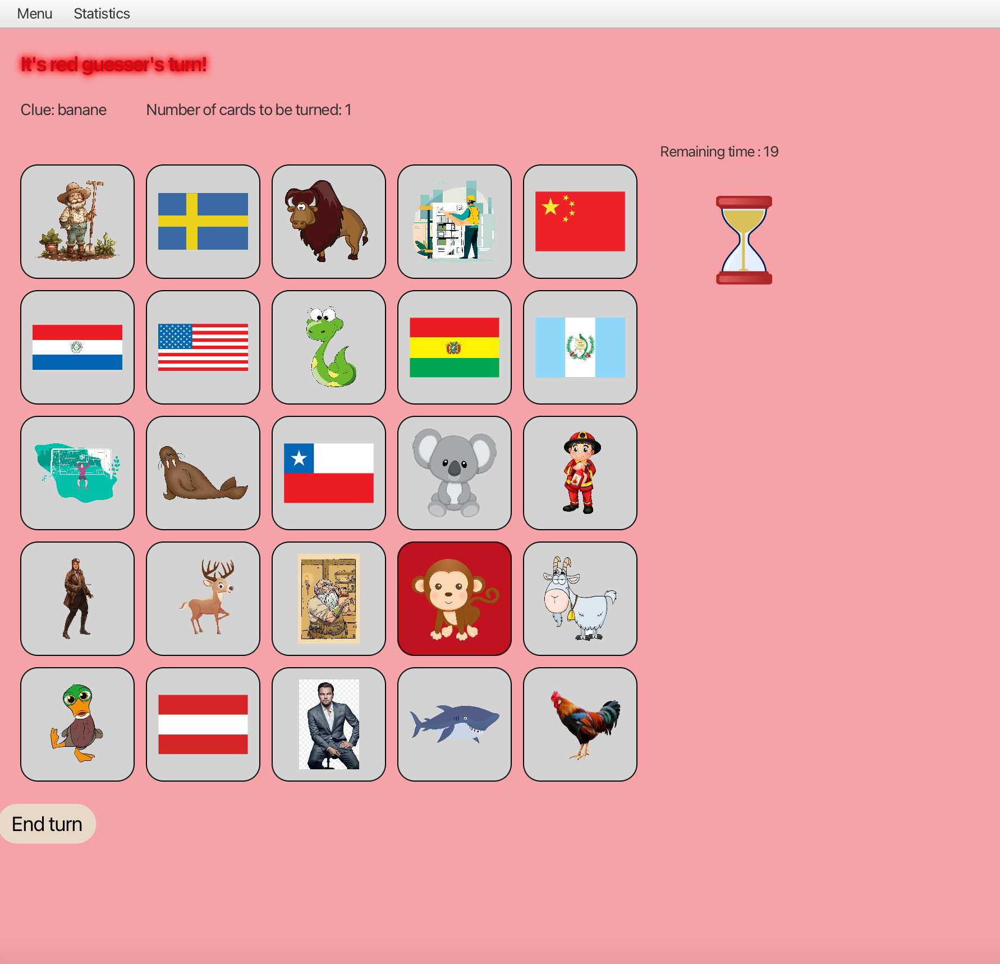 

Cette page est la page du jeu du **GUESSER** en mode **Image**.

# La page SPY

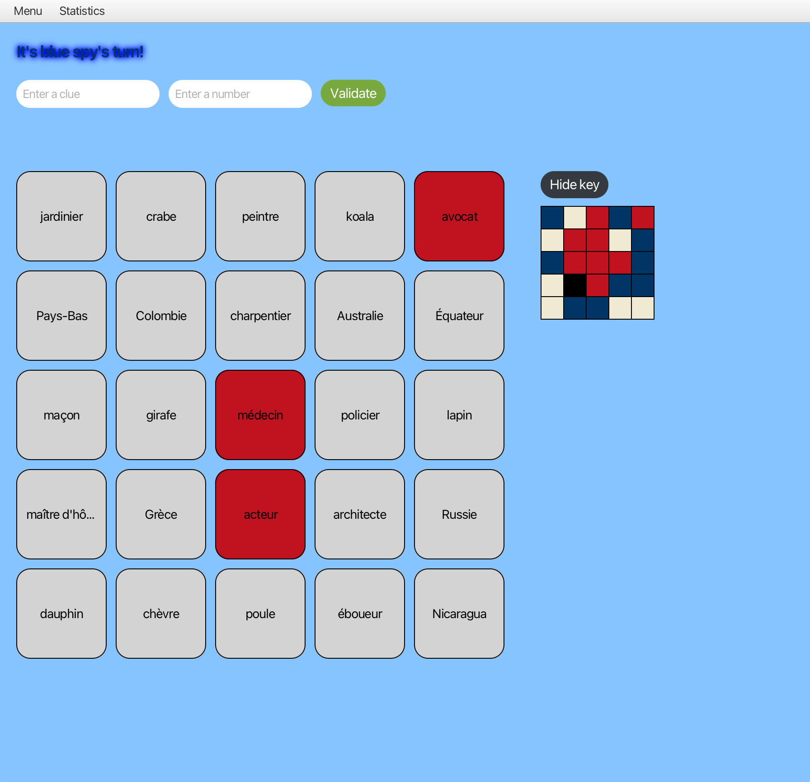

Cette page est la page de jeu du **SPY** en mode **Word**.
Ici, on constate que c'est au du **SPY bleu** de jouer. 
Plusieurs actions sont possibles :
- Cliquer sur le bouton *Menu* qui affiche un menu déroulant permettant, au choix, de charger une ancienne partie non terminée, sauvegarder la partie actuelle ou retourner à la page d'accueil. 
- Cliquer sur le bouton *Statistics* qui affiche les statistiques de jeu des équipes.
- Cliquer sur le bouton *Show key* qui affiche la clef de la grille. Il peut ensuite cliquer sur le bouton *Hide key* pour la cacher. 
- Entrer un indice dans le champ de texte puis le nombre de mots associés à cet indice et ensuite cliquer sur le bouton *Validate* afin de finir son tour et d'envoyer l'indice au **GUESSER**. 

La grille se met à jour à chaque fois que le **GUESSER** joue afin que le **SPY** puisse voir les cases découvertes. 
La couleur du fond de la page est celle de l'équipe qui doit jouer.

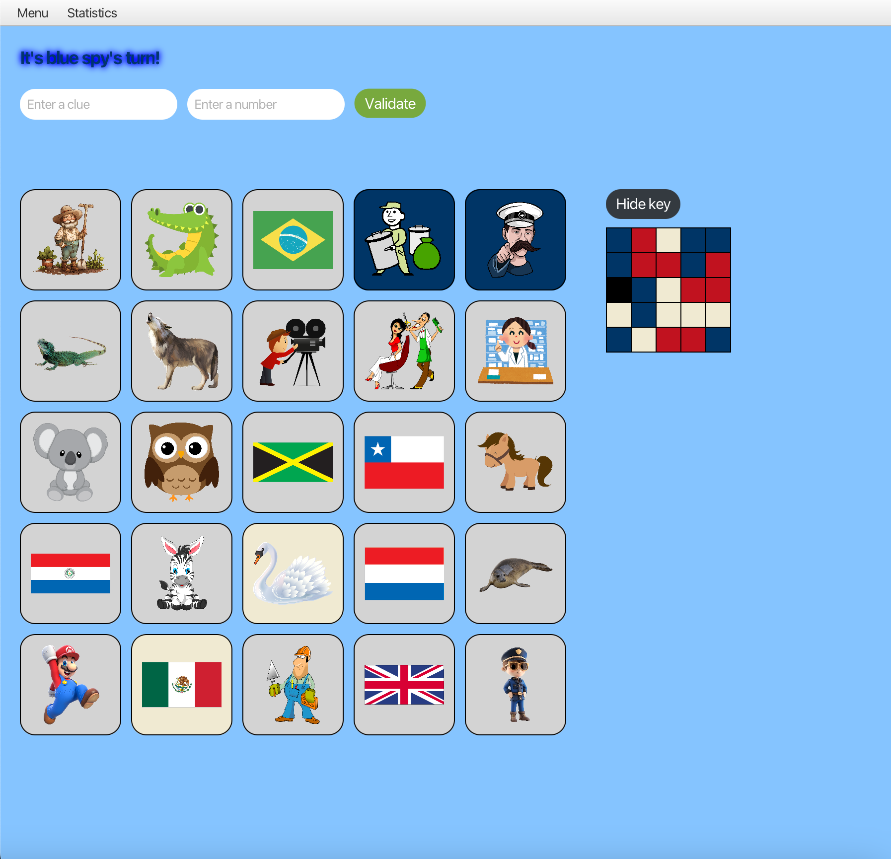

Cette page est la page de jeu du **SPY** en mode **Image**. 
On peut constater qu'ici, deux cases neutres ont été révélées (le drapeau du Mexique ainsi que le cygne). 

# La page GAME OVER

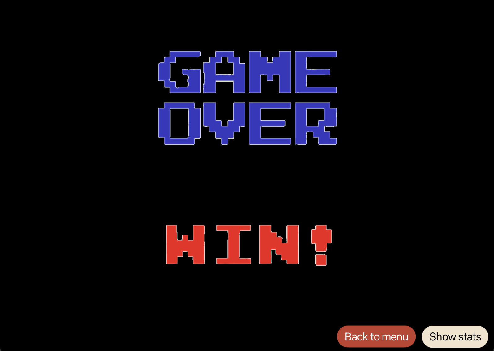 

Cette page s'affiche lorsque la partie est terminée et que l'équipe blue a perdu. 
L'utilisateur n'a plus qu'à cliquer sur le bouton *Back to menu* pour revenir à la page d'accueil. 
L'utilisateur peut aussi cliquer sur le bouton *Show stats* pour afficher les statistiques de jeu des équipes.

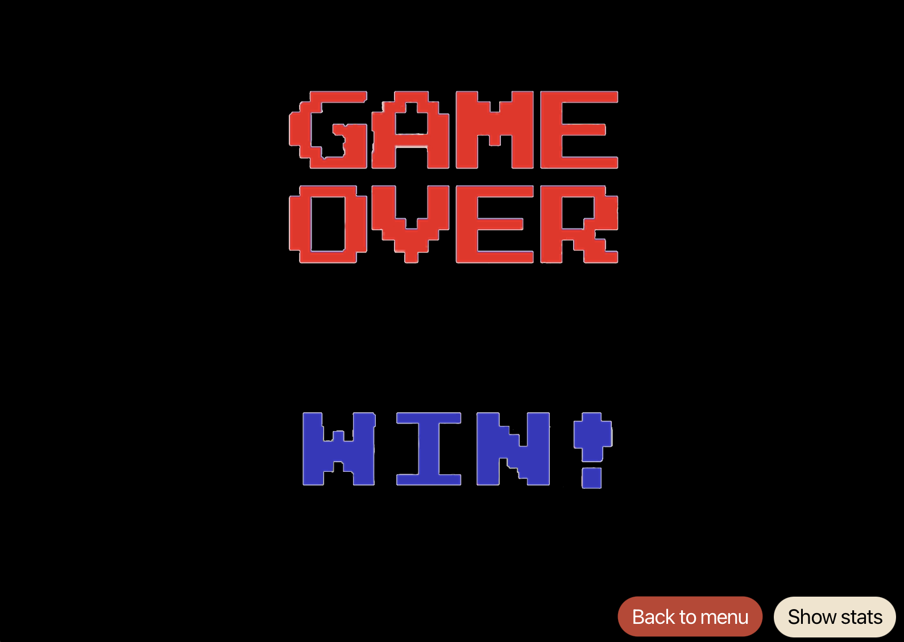

Cette page s'affiche lorsque la partie est terminée et que l'équipe rouge a perdu.
L'utilisateur n'a plus qu'à cliquer sur le bouton *Back to menu* pour revenir à la page d'accueil. 
L'utilisateur peut aussi cliquer sur le bouton *Show stats* pour afficher les statistiques de jeu des équipes.

# La page STATISTIQUES

Cette page affiche les statistiques de jeu des équipes.
Elle affiche le nombre de parties jouées, le nombre de parties gagnées par chaque équipe et le ratio indices données / bonnes cartes trouvées.
Via le menu déroulant *Select Data to Display* l'utilisateur peut choisir d'afficher différentes statistiques comme le nombre de parties jouées, les victoires par équipes, les indices donnés ainsi que les bonnes cartes trouvées via différents graphiques.

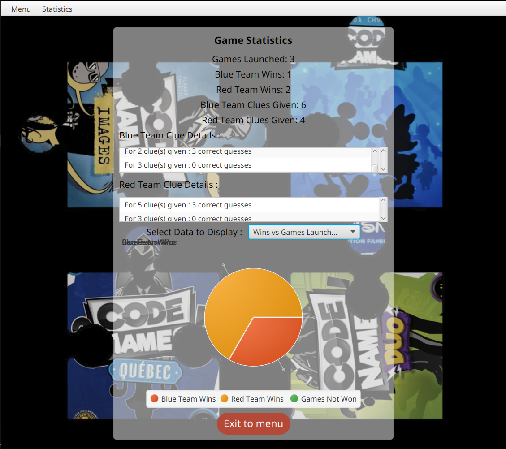

Cette page affiche le nombre de parties gagnées par une équipe en fonction du nombre de parties jouées. 

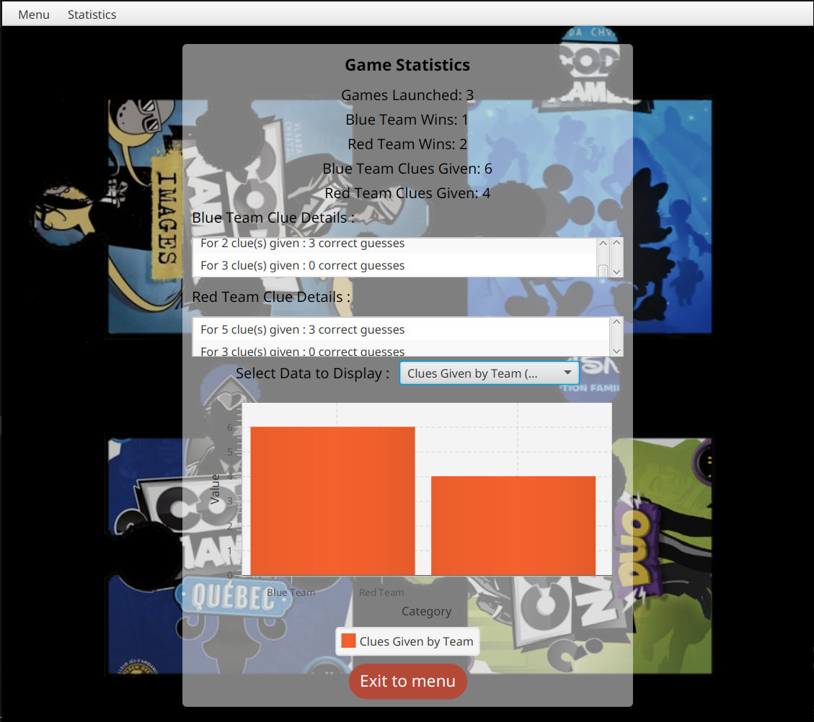

Cette page affiche le nombre d'indices donnés au total par chaque équipe. 

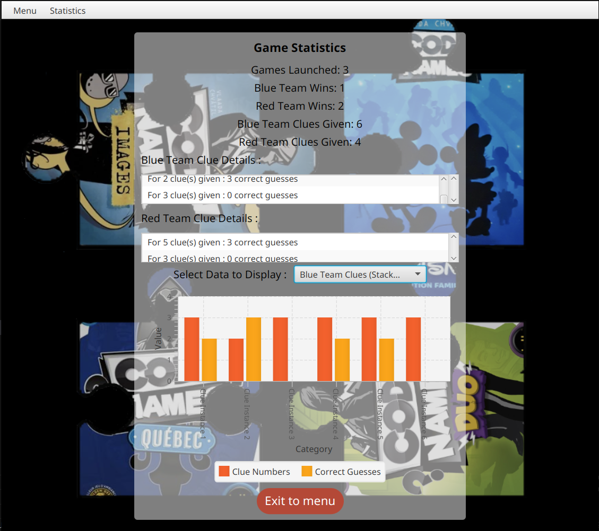

Cette page affiche le nombre de cartes sensées être retournées lorsqu'un indice est donné et le nombre de cartes correctes retournées lors de ce tour. 
Ces statistiques sont celles de l'équipe bleue. 

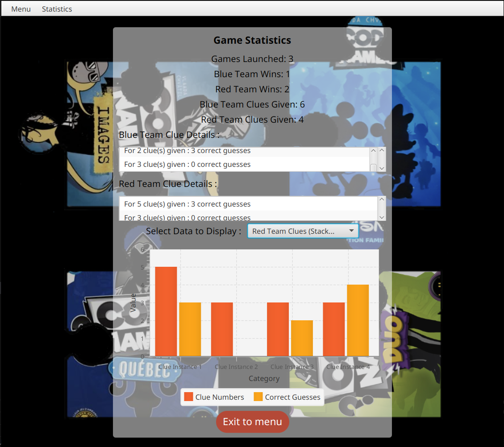

Cette page affiche le nombre de cartes sensées être retournées lorsqu'un indice est donné et le nombre de cartes correctes retournées lors de ce tour.
Ces statistiques sont celles de l'équipe rouge.

# Les tests

Nous avons effectué des tests unitaires sur les classes de notre projet. 
Vous pourrez les retrouver dans le dossier [tests](./src/test/java/testscodingweek/testsmodels).

# La planification

En cliquant sur ce lien : [Roadmap](./roadmap), vous pourrez avoir accès à la planification de notre projet sur la semaine de Coding Week. 
Chaque fichier correspond au *release* d'une journée de la semaine, avec les tâches effectuées par demi-journée ainsi que les objectifs pour le lendemain. 

# Le diagramme de classes

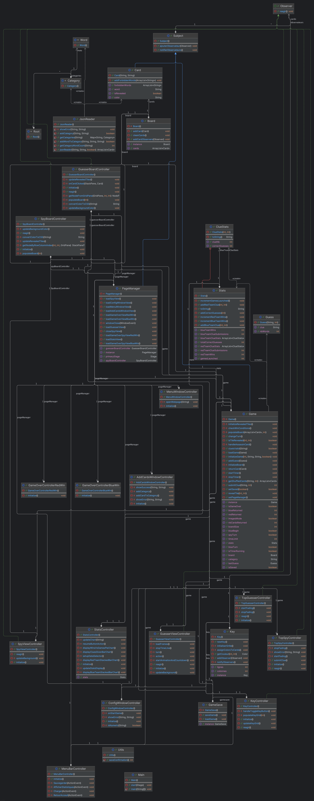

Le code de ce diagramme se trouve dans le fichier [main.plantuml](./diagram/main.plantuml).

